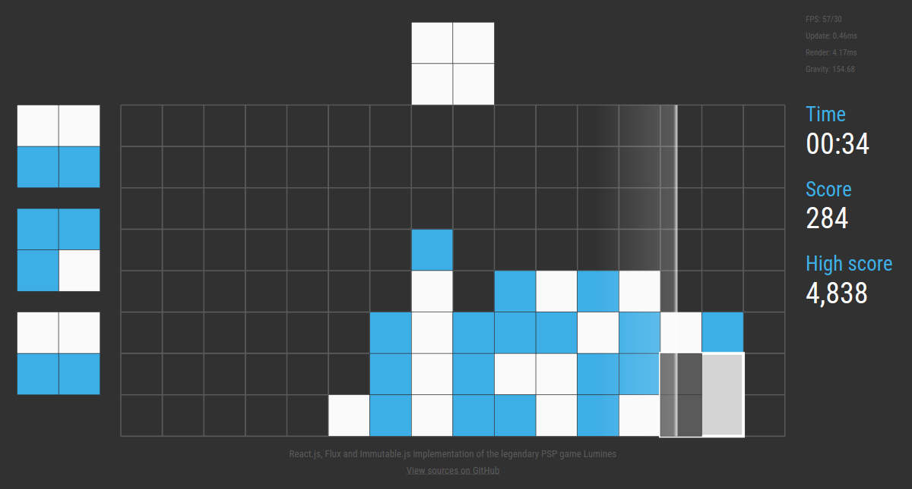

# flux-lumines

Lumines implementation using modern JavaScript technologies, including React.js, Flux and 
Immutable.js

Check out [this video](https://www.youtube.com/watch?v=C4sE17kK2iM) showing the game play and 
also some of the neat Flux capabilities.

[](./img/screenshot.png)

## Have you ever tried to update the React UI 60 times per second?

What's making this game special is that it actually renders at 60 fps creating buttery smooth 
game play experience. And it's written completely in React! **So what's under the hood?**

* The actual graphics is drawn in **SVG**. SVG in browsers is probably not as powerful or 
performant as WebGL but it's way easier to use and it's still strong (offering many cool features 
like advanced animations or filters). And you can style it with CSS!
* The UI is built with **React**. React plus SVG is a *killer combination* 
([although the support is not 100%](https://facebook.github.io/react/docs/tags-and-attributes.html#svg-elements)). 
As you would expect, the interface consists of many separated re-usable components, 
making the whole UI definition clean and understandable. Also don't forget what's the main point 
of React: you *don't mutate* the UI, you *re-render* it. So the game works very similarly to 
a typical OpenGL/WebGL application. But instead of painting with GL commands into a framebuffer, 
you can enjoy the comfort of React and SVG.
* In the heart of the game is the [**Flux**](https://facebook.github.io/flux/) cycle, with the 
stores, the dispatcher and actions. The state of each game component (block, queue, scan line, 
score, time...) is represented by a separate store handling incoming actions. And the actions are
usually just the keyboard input coming from the player.
* Finally, what's making the game fast enough is the fact that the whole state is stored in 
a big global [**Immutable**](https://facebook.github.io/immutable-js/) state. Thanks to the 
immutability we can easily check for changes in any part of the state and consequently 
[update only those React components that need it](https://facebook.github.io/react/docs/advanced-performance.html).
All components are implemented as [*pure*](https://facebook.github.io/react/docs/pure-render-mixin.html).

That's the base game. But wait... there is more. This application architecture allows us to do 
pretty crazy stuff with  minimal effort.

* As the game state is just one immutable object, we can easily serialize it, unserialize it or 
even transfer it. Therefore implementing for example saving and reloading the game from Web 
Storage (so that the player can pause the game, close the browser and continue anytime later) is 
just a matter of few lines of code.
* Or you can go even further and share the state using the Web Storage between the tabs. (The 
performance would probably be bad).
* The stores (which are the game state) are updated through actions. *Only* through actions. That 
means, that the current state is completely determined by the sequence of previous actions.
What is it good for? Well, you can for example record the actions as the user plays and when he is 
finished, you can replay it back to him. Once again, this can be achieved with only several 
lines of code.

You might have heard about these possibilities. But I have actually implemented them. Check out 
[this separate repo](https://github.com/tobice/flux-lumines-demos) with some demos based on 
Lumines.

**Interested in more information about how Lumines is implemented?**

I wrote an article summing up most of the challenges that I run into when writing this game. You
can find it in this repo Wiki: [Making of Lumines](https://github.com/tobice/flux-lumines/wiki/Making-of-Lumines)


## Wanna try it out?

At this point, it's available online only on [my personal webpage](http://tobice.cz).

If you want to play it locally, just clone this repo and then run:

```
npm install
npm run dev
```

Node.js is required. You can access the game from the browser on 
[http://localhost:9090/](http://localhost:9090/).

You can also include it in your own project. The game is not currently available in npm but you 
can just as easily add it as a GitHub dependency. Just add 
`"flux-lumines": "tobice/flux-lumines"` to your `package.json`.

The application needs to be built and currently [webpack](http://webpack.github.io/) is the only 
supported bundler. Check out the [demos repo](http://webpack.github.io/) for more information.

