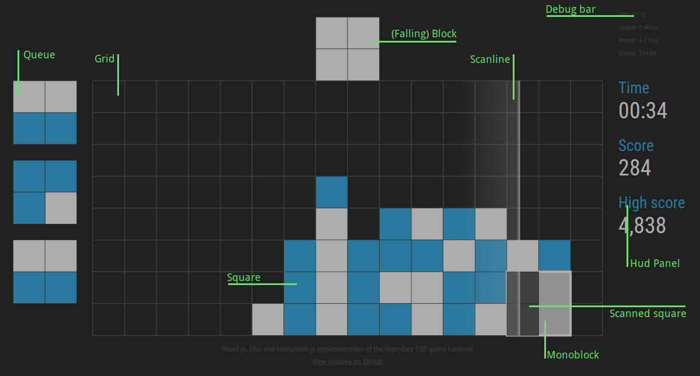
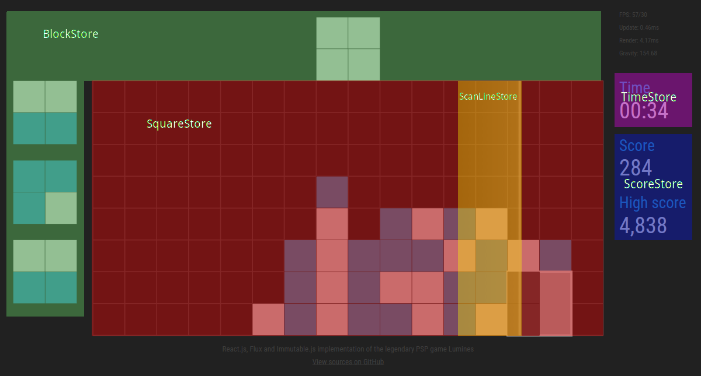

# Making of Lumines

As Lumines is not a typical React application (and I also tried some of the latest trends 
and tools, like using the global immutable state), I ran into various issues and challenges. I'll
try to cover the most interesting ones in the following text.

**Table of contents**
* [User interface scheme](#user-interface-scheme)
* [The Flux](#the-flux)
* [The actions](#the-actions)
    * [Main game loop](#main-game-loop)
    * [Making the game deterministic](#making-the-game-deterministic)
* [The stores](#the-stores)
    * [Using waitFor() ](#using-waitfor)
    * [Circular dependencies](#circular-dependencies)
    * [The global immutable state](#the-global-immutable-state)
    * [Working with Immutable objects: cursors and DAOs](#working-with-immutable-objects-cursors-and-daos)
    * [The danger of using nested cursors](#the-danger-of-using-nested-cursors)
    * [Immutable Records](#immutable-records)
    * [Storing and reviving the global state with custom immutable structures](#storing-and-reviving-the-global-state-with-custom-immutable-structures)
* [The view](#the-view)
    * [Pure React components](#pure-react-components)
    * [Using SVG to paint the UI](#using-svg-to-paint-the-ui)
* [Bonus demo: running Lumines on the server](#bonus-demo-running-lumines-on-the-server)
* [The conclusion](#the-conclusion)

## User interface scheme

The following text is about this game which means that I'll be quite often referring to game 
components and entities. To give you a better idea of what names are used, here is a simple 
scheme of the user interface.

[](./ui-scheme.png)

## The Flux

Flux is what drives this application. It's an application architecture or maybe just a pattern,
introduced (or popularized) by Facebook. If you are not familiar with Flux, you should check 
out the [website](https://facebook.github.io/flux/docs/overview.html#content).

The nice thing about Flux is that you can get a pretty good idea of how it works just by looking 
at a single picture (and I'm going to borrow that picture from their website).


An **action** represents some kind of event that occurs in the application. **Store** is what is 
holding the current application state (like squares on the grid, the falling block, elapsed time etc.) 
and a **view** is just a view, it's what you see on the screen. **Dispatcher** is what ties this 
all together, distributing actions to the stores.

To give you an idea how Flux works in Lumines, here is an example:

1. The player hits the button **A**.
2. Action `ROTATE_LEFT` is created and dispatched using **dispatcher** to all stores.
3. The `BlockStore` will respond to this action and update itself. It will rotate the falling 
block to the left.
4. The whole game UI (React components) is rerendered.

Compared to the original idea of Flux, there are several simplifications in Lumines. For example,
there are no action creators as the actions are really simple. Also the stores don't emit any 
*change* events to notify the view. The view is updated every time an action is dispatched.

The main feature of Flux is that the data flow is unidirectional making the whole application 
easier to reason about. Lumines is actually very simple so it wouldn't make sense doing it any 
other way, but there are other Flux features that will turn out extremely useful.

## The actions

Most of the *actions* used in Lumines are very simple and are directly bound to key strokes. 
The purpose of these actions is to control the game. The `ROTATE_LEFT` action was a typical 
example but obviously there are more: `ROTATE_RIGHT`, `MOVE_LEFT`, `MOVE_RIGHT`, `PAUSE`, 
`RESTART` etc.

### Main game loop

One special action is the `UPDATE` action. This action creates the *illusion* of time in the game. 
It's dispatched approximately 60 times per second and carries the time elapsed since the last 
dispatch of this action. This action basically shifts the time pointer in the game which is 
crucial for the game mechanics.

One of the elements it directly affects is the **scan line** (the line going from the left to the
right, sweeping the grid) which is represented in the `ScanLineSore`. The line is defined by 
it's current `x` position and by its speed. When the `UPDATE` action is dispatched, the store 
responds and increases the `x` position by speed times elapsed time.

To make the game as smooth as possible, the individual dispatches (and UI re-renders) are 
synchronized with the browser repaints. That can be achieved using the 
[requestAnimationFrame()](https://developer.mozilla.org/en-US/docs/Web/API/window/requestAnimationFrame)
function. So the main game loop looks as follows:

```javascript
const clock = new Clock();
const update = (time) => {
    let elapsed = clock.next(time) / 1000;
    this.dispatch(UPDATE, {time: elapsed});
    this.render();
    requestAnimationFrame(update);
};
requestAnimationFrame(update);
```

If you ever created a WebGL/OpenGL application, this should look very familiar to you. The `time`
parameter passed to the update function is the current timestamp. The `Clock` utility is used to 
measure/calculate the elapsed time between individual ticks.

### Making the game deterministic

There is another special action: `REFILL_QUEUE`. As the game runs, new and new blocks are taken 
from the queue on the left and naturally the queue has to be refilled. The new blocks 
are generated (if needed) in the main game loop and added to the queue using the `REFILL_QUEUE` 
action. The actual block definition (what colors the 4 squares are) is sent as payload with the 
action.

That sounds like something that is part of the game business logic and should happen automatically.
So why is there a special action for that?

The problem is that there is a random element involved. The new blocks are generated randomly. By
taking the block generation out of the core, we make the game 100% deterministic. Therefore at 
any point during the game, **the actual state depends completely on the previous actions**. So if you
want to record the game and then replay it, it's very easy. All you have to do is to register to 
the dispatcher and remember all dispatched actions (with timestamps). After that you can simply start a 
new game and then dispatch all the recorded actions in correct order with appropriate timing (or 
not, you could dispatch all the actions at double speed. What matters is the time information 
carried with the `UPDATE` actions).

This obviously wouldn't work if the block generation was left in the game core. You could of 
course record all the actions and remember what the player *did* (his moves) but it wouldn't make
any sense as the game situation (squares on the grid) would be completely different.

An actual implementation of this can be found [here](https://github.com/tobice/flux-lumines-demos/blob/master/recording/recording.js).

## The stores

The game consists of several separated logical components and each one of them is represented by 
a single store. A typical example is the `ScanLineStore` that represents the scan line. To give you
an idea of which stores exist in the game and what they are responsible for, here is a simple 
schema.

[](./store-scheme.png)

Not all stores are on the scheme (their presence wouldn't make much sense). Those are 
`ConfigStore` (holds current game's configuration), `GravityStore` (current gravity affecting the 
speed of falling squares) and `GameStateStore` (current state, like `PLAYING`, `PAUSED`, `OVER`...).

All stores are registered to the **dispatcher** and listen to all incoming 
actions. Regarding stores, there are several neat features stemming from the Flux pattern:

1. All stores can be updated only through actions.
2. All actions come through a single entry point in the store.
3. A new action cannot be dispatched before the previous is finished. That also means that all 
stores are updated at once in a single run, always leaving the application in a consistent state.
3. The data inside a store are accessible from the outside only through a read-only public API.

The result is that it is really easy to reason about what is happening in the store. To give you 
an idea, this is how the `ScanLineStore` looks from the inside:

```javascript
class ScanLineStore extends BaseStore {
    constructor() {
        // Init default values
    }

    handleAction({action, payload}) {
        switch (action) {
            case RESTART:
                // Reset the position 
                break;

            case UPDATE:
                // Move the line
                break;
        }
    }

    get position() {
        // Return the position
    }
}
```

*Notice some of the ES6 syntax sugar at work, like destructing or getters.*

### Using `waitFor()`

Sometimes it is necessary to enforce the order in which the stores are updated. For example, we 
want to first move the scan line and only when that's done we want to update the square grid. 
This can be achieved using a not very common method of the dispatcher 
[`waitFor()`](https://github.com/facebook/flux/blob/master/src/Dispatcher.js).
(I'm talking about the Facebook's implementation of Flux).

When you're about to perform an update inside a store, but you need to make sure that another 
store is updated first, you simply call this method with the desired store as the method argument.

The name of this method might suggest that there is some kind of *asynchronicity* involved (like 
waiting for another thread to finish) but that's not true (besides, JavaScript is single-threaded). 
The dispatcher simply checks whether the store you want to wait for is already updated (using current
action) and if not, it updates it first. 
 
This way you have a complete control over what is going on in the application and everything is 
nicely separated. It's perfect... except it's not.

### Circular dependencies

Flux is an easy to understand concept but once you try to actually use it, you might soon get 
into trouble. One of the complications that might arise are circular dependencies between 
stores. Consider following example: 

* The `GameStateStore` is holding the information about the current state of the game (like 
**PAUSED**, **PLAYING**, **OVER** etc).
* The `SquareStore` contains the information about the squares and their positions and colors on 
the grid.

The `SquareStore` responds to the `UPDATE` action but only when the state is **PLAYING** (the 
action is ignored when the game is paused or over), so it depends on the `GameStateStore`. On the
other hand, if during an update the game comes to an end (which happens in the `SquareStore`; the
squares on the grid reach the upper row), the `GameStateStore` has to detect that and flip the 
status which means it depends on the `SquareStore`. To make it more clear, here is exactly what 
might happen in the game:

1. An `UPDATE` action is dispatched. 
2. `SquareStore` responds to this action first and checks the `GameStateStore` if the game is on.
Let's say it is. 
3. The `SquareStore` updates all squares on the grid and it turns out that  
some of the squares reach the upper row which means game over.
4. `GameStateStore` responds to the action second, checks the `SquareStore` and as the game is 
over, it changes the state to **OVER**.

There is a circular dependency. Both stores need to access each other. Why is it a problem? Well, 
the stores are usually implemented as JavaScript modules which are then `required` whenever needed.
The modules of which the application consists form a dependency tree which obviously doesn't allow 
any circular dependency. What now?

The main objection could be that this is a matter of bad design. Since the game over actually 
happens in the `SquareStore`, information about it should be held in the `SquareStore` as well. 
So those two stores should be merged into one. Unfortunately, there are other stores that are by 
this problem affected as well and they would have to be also merged into one. As a result, 95% of
the application logic would be handled by a single store.

That is actually not a problem, there are many ways how to organize and separate code and it 
could all happen within this one store. It would be probably the cleanest solution. But I really 
liked my stores so I decided to follow this path.

The important thing to realize is that there are actually two types of circular dependencies 
that might occur.

1. The first one is related to the order in which the stores respond to an action
(*action dependency graph*). The order is enforced 
by the `waitFor()` method and if a store A waits on a store B, clearly the store B can't wait on 
the store A at the same time. But our situation is not this case. In our situation, the order is 
quite simple: the `SquareStore` goes first and `GameStateStore` goes afterwards. What might 
happen is that for one action A waits for B, and for another B waits for A. But that's okay. Even
the Facebook devs [say](https://github.com/facebook/flux/issues/144#issuecomment-72797512) it's 
okay to have different dependency graphs for different actions.
2. The second one is on the *module* level, ie. which stores need to access each other. That is 
our case, because `SquareStore` needs to check `GameStateStore` and at the same time, 
`GameStateStore` needs to access `SquareStore`. Remember that the stores can be changed only 
through actions and that their content is accessible only through public read-only API. Therefore
by *access* I mean *read*. We can talk about *read dependency graphs*.
 
To deal with everything mentioned above, I simply decided to implement stores as individual 
instances, put them all into one *pool* and shared that *pool* among the stores. Therefore the 
stores can arbitrarily read from each other. 

That might sound dirty but don't forget:

* The stores can only read from each other, they can't change each other.
* The stores can change only through actions and the order in which they respond to actions is 
strictly given.

You have to also realize that it's similar to when you work with a set of variables in the same 
scope. Sometimes there is no hierarchy.

Last remark on this topic: This problem of circular dependencies does exist, there is even an 
[issue](https://github.com/facebook/flux/issues/28) for that. The conclusion might be that Flux 
simply doesn't fit all situations. 

### The global immutable state

Until now we've been saying that the current game state is held in the stores. This is still true
from the architecture point of view, but from the implementation perspective (i. e. how the 
stores are implemented) the actual data is not stored directly in the stores but in one global 
immutable state. It could be said that the stores are using an external storage for the data 
(something like a database).

This idea isn't mine. I took it over from the [Este.js dev stack](https://github.com/steida/este)
and I think it originated in [Om](https://github.com/omcljs/om).

Let's focus on the word **global**. That means that all application data is stored in a single 
JavaScript object. It consists of hierarchically structured *maps* (or just JS *objects*) and 
*collections* (or *arrays*). The stores work sort of like a *view* on the data. It does resemble 
the typical app structure where you store all data in a database and you access it through 
a higher *model* layer.

What is it good for? Because it's only one object, you can very easily store it somewhere or even
move it around and share it. I implemented two demos to demonstrate this capabilities. 

* In the [first demo](https://github.com/tobice/flux-lumines-demos/blob/master/save-state) whenever you 
pause the game, the state is saved to the Web Storage which means that you can close the 
browser and when you re-open it you can continue where you left. The game just picks up the state
if it's available.
* The [second one](https://github.com/tobice/flux-lumines-demos/tree/master/share-state) is even more 
fun. Every time the state changes (which means every time an action is dispatched), it's stored 
to the Web Storage. Then you can open another browser window and *listen* to those changes. The 
result is that the game play is in real time *mirrored* to the second browser window. Obviously 
the performance isn't great in this case.

Both demos are really short (just few lines of code) which shows how powerful this technique is.

Okay, now let's move to **immutable**. The global state is implemented as immutable using the 
[Immutable.js](https://facebook.github.io/immutable-js/) library published by Facebook. I won't 
go into details as it's kind of complex. If you are not familiar with it I really recommend 
checking out the documentation or this [amazing video](https://www.youtube.com/watch?v=I7IdS-PbEgI) 
which perfectly sums up what it is and why it's so good.

To sum it up: When an object is immutable, it means that once it's 
created, it cannot be changed. Look at the following example: 

```javascript
var map1 = Map();
var map2 = map1.set('b', 2);
```

That's it. Once you try to alter the old map, a new map instance is created instead. 

This has all sorts of benefits but what's interesting for us is that you can compare two objects 
just by comparing their references. Therefore when the UI is rendered, you can very easily (and 
efficiently!) detect which parts of the global state have changed and therefore which parts of 
the UI should be updated. The consequence is that we can actually afford to re-render the UI 60 
times per second as always only a small part of the interface is actually changed (check the 
video for more detailed explanation).

### Working with Immutable objects: cursors and DAOs

Immutable objects are cool and the Immutable.js API is really powerful. Yet still, the actual work 
can get a bit cumbersome. There is one big global object that is shared among all the stores 
and they all need to write changes to the state. But every change generates a completely new 
object which we have to remember the reference of. And distribute it among the stores.

The smart guys decided to solve this using **cursors**. I said that the global state works sort of 
like a database. Then a cursor could be a connection to the database, pointing to a specific 
table. Except in the case of a JavaScript object it's not really a table (there is no scheme), 
it's just pointing to a certain place in the object hierarchy, and instead of SQL queries, we use
update functions.

I used the cursor implementation from [Este.js dev stack](https://github.com/steida/este). Let's 
say that our object has the following structure:

```javascript
{
    'ScanLineStore': {
        'position': 0
    }
}
```

This is how you'd use the cursor: 

```javascript
const positionCursor = state.cursor(['ScanLineStore', 'position'], 0);
while (positionCursor() < 10) {
    positionCursor(position => position + 1);
}
```

This cursor points directly to the scan line position which is an integer. Just calling the 
cursor as a function returns the current value. If you want to change the value, pass an 
update function as the first argument.

In Lumines, the cursors don't usually point to single values, but rather to complete (sub)
objects that represent contents of a store. So every store has its own cursor (or possibly more) 
through which it changes the global state.

That's cool but still not perfect. 

The game logic of Lumines is not complicated but it's also not trivial. And writing the core directly
using cursors and Immutable.js API makes it hard to read. There is lots of boilerplate code which
makes the key parts not very clear. 

Let's go back to our database analogy: In database-based applications it's not very common to write 
the business logic directly in SQL queries. The usual practise is to add another layer of 
abstraction over the database. Repository, Data Access Object, ORM... or whatever, the approaches
differ but the ultimate goal is the same.

So that's exactly what I did in Lumines, I wrapped the main game concepts by DAOs that  provide 
nicer and easier-to-read API over the immutable data. An example of such a DAO is the object
wrapping the falling block. Look at the following snippet of code:

```javascript
class Block extends ImmutableDao {
    // ...
    
    get dropped() {
        return this.cursor().get('dropped');
    }
    
    // ...
}
```

Notice the ES6 getter. Checking whether block has been dropped is now very straightforward:

```javascript
if (block.dropped) {
    // ...
}
```

So even though the data is stored in an immutable structure, the code I'm writing actually looks 
very *normal*. The immutability and the global state were moved to a lower layer and became an 
*implementation* detail that I don't have to care about when writing higher level code.

Well, almost.

### The danger of using nested cursors

When working with multiple cursors, you must never 
forget that you are still changing a single object. Let's say you have two cursors pointing to 
two different lists and you want to move some elements (determined by the `predicate` function) 
from the first list to the second.

```javascript
list1Cursor(l1 => 
    l1.filter(el => {
        if (!predicate(el)) {
            list2Cursor(l2 => l2.push(el));
            return false;
        } else return true;
    });
);
```

This will not work and to see why we have to look at how a cursor is actually implemented. This 
is a pseudo-code of a cursor initialized for a specific path in the state object

```javascript
let state, path; // somehow initialized in the outer scope

function cursorExample(update) {
    if (update) {
        state = state.updateIn(path, update);
    }
    return state.getIn(path);
};
```

Nothing surprising here. If you pass an update function to the cursor, it's applied on the 
current state which will generate a new state. The reference on the new state is  remembered. And 
that's exactly where the code above fails.

As the first list is being cycled over, we add the filtered out elements to the second one which 
changes the global state. The problem is that the outer update function in the first cursor has 
still the reference to the initial state. Which means that when the update function is done and 
the elements are removed from the list, those changes are applied to the initial state and not 
the new one where the second list contains the removed elements. So when in the final step the 
reference to the updated state is remembered, a half of the changes is lost.

What is dangerous about this is that this *feature* is well hidden. The fact that the cursors 
point to the same global object and that they shouldn't be used like this is not obvious  from the 
code, especially when you introduce the extra abstraction layer as explained above. Therefore making
this kind of a mistake is easy and it takes some time to discover what exactly is going wrong here.

Unfortunately, this sort of breaks the nice illusion created by the higher API because you have 
to be aware of the implementation details of the underlying layer. One solution might be to 
re-implement the cursors so that they would be able to detect nested calls. For example the Flux 
dispatcher is doing the same thing. You can't dispatch a new action before you finish
handling the previous one.

### Immutable Records

Immutable.js library offers lots of data structures. One of them is 
[Record](https://facebook.github.io/immutable-js/docs/#/Record). It's basically a map (or an 
*associative array* if you want) except you can specify the set of allowed string keys and 
default values. It's like a JS object with an enforced scheme.

One of the features of this structure is that you can use standard getters to access the values. 
So instead of `obj.get('property')` you can write `obj.property`. That's a nice shortcut but 
what's more important, it makes the ES6 *destructing* work (which turns out to be one of my most 
favorite ES6 features). For example, this is a function that returns whether there is a square on
given grid coordinates:

```javascript
function isFree({x, y}) {
    // ...
}
```

Declaring the function parameters this ways is similar to using *interfaces*. It's like saying 
"you can pass whatever you want to this function, it just has to have `x` and `y` properties". It
doesn't work with most of the Immutable structures but it does work with Records, and that is cool.

For these reasons several many entities are implemented as Records in Lumines. That, however, 
brings another challenge.

### Storing and reviving the global state with custom immutable structures

Lumines supports storing and restoring the global state (as described 
in the beginning of this chapter, it's an easy way how to save the game or transfer current game 
state somewhere else). Storing and restoring is based on the Immutable.js API (`toJS()` and `fromJS
()`) that allows conversion between immutable structures and standard JavaScript structures
(objects and arrays).

Converting to JS is [straightforward](https://facebook.github.io/immutable-js/docs/#/Iterable/toJS): 

* all structures with strings as keys are converted to objects
* all structures with numeric keys are converted to arrays 

Converting back is straightforward as well: objects are converted to Maps and arrays to Lists. 
**But wait!** What if the original immutable object wasn't a Map but something else? 
For example a Record? Or a normal object (yes, you can store standard objects in an immutable
structure, although it doesn't make much sense). 

Yes, unfortunately this means that the individual immutable object types get lost during the 
store/restore procedure which makes it kind of useless. The Immutable.js API offers an option to 
use a custom [reviver](https://facebook.github.io/immutable-js/docs/#/fromJS) which defines to 
what kind of structures the input data should be revived. But that's also hardly a perfect 
solution because that somehow expects that you know the complete structure of the immutable 
object when you are reviving the data. Probably the cleanest solution would be to let each 
individual object (in this case probably a store) decide about the way it gets stored and 
restored. But then the whole magic of having a global state disappears!

To avoid that, I decided to implement a slightly smarter reviver as a compromise solution. In 
Lumines, this issue affects only Records. And Records are cool because they have a fixed set of
keys. So what I'm doing is that when I'm about to revive a JavaScript object, I simply compare 
the set of object's keys with the keys of existing Records, and if I find a match, I convert that
object to this particular record.

```javascript
const squareKeys = (new Square()).keySeq();
if (value.keySeq().equals(squareKeys)) {
    return new Square(value);
}
```

The solution is hardly universal but in this case it works quite well.

## The view

The view is the last missing piece in the Flux cycle. Although Flux is a universal pattern that 
can work with any technology, it was originally designed to complement React. Which is exactly 
what Lumines uses for its view layer.

### Pure React components

All the components that are used in Lumines are *pure*. That means that they don't maintain any 
state. All state is held in the global state and is passed as `props` from the root component down 
the component hierarchy. A pure component behaves sort of like a function. You pass the data as 
arguments and it returns the "HTML code". That's it.

The components also don't listen to store updates. Instead, the component update is invoked 
manually whenever an action is successfully dispatched. Invoking an update from outside of the 
component hierarchy is simple. You just repeatedly call `React.render()` on the same mount point.  

```javascript
class Lumines {
    // ...
    
    render() {
        React.render(<GameInterface
            scanLine={this.scanLineStore.scanLine}
            state={this.gameStateStore.state}
            // ...
            }} />, this.mountpoint);
    }
}
```

Whenever `Lumines.render()` is called (even from the outside of the game), the components perform
an update so that the UI would correspond the global state.

The last important feature of pure components (which was already mentioned) is that every 
component detects incoming updated data (`props`) and decides whether it should update and 
re-render. Obviously under normal circumstances comparing two deep JS objects would be expansive.
But as the whole state is immutable (consisting of immutable structures), we can do the 
comparison very quickly just by comparing the references of the current data and the incoming data. 

How to make a component *pure* so that all of the above works? There is a 
[PureRenderMixin](https://facebook.github.io/react/docs/pure-render-mixin.html) for that which in
case of ES6 syntax can be replaced with a 
[base pure component](https://github.com/gaearon/react-pure-render). Once again I recommend this 
[nice (and not very long) video](https://www.youtube.com/watch?v=I7IdS-PbEgI) which explains all 
of this.

### Using SVG to paint the UI

For those of you who didn't know, SVG is internally an XML-based format. It's like HTML (or 
possibly XHTML) except the tags are different. You can always include SVG image using the `img` 
tag but the browsers nowadays support *inline* SVG. That means that you can actually put SVG code 
directly in the HTML markup.

Just a simple example of a circle painted with SVG (taken from 
[W3Schools](http://www.w3schools.com/html/html5_svg.asp)):

```html
<!DOCTYPE html>
<html>
<body>

<svg width="100" height="100">
  <circle cx="50" cy="50" r="40" stroke="green" stroke-width="4" fill="yellow" />
</svg>

</body>
</html>
```

SVG uses internal coordinates which by default map to pixels. But that behavior can be changed 
using [`viewBox`](https://developer.mozilla.org/en-US/docs/Web/SVG/Attribute/viewBox).

```html
<svg viewBox="0 0 160 90" >
</svg>
```

This way you define that the SVG image will be 160 points wide and 90 points high. This 
coordinate system will be used when positioning the SVG objects inside the image. But the actual 
size of the image on the screen can be arbitrary or even responsive!

This is exactly how Lumines is done. The game UI has strict inner dimensions which allow easy and 
exact positioning of the game elements (these coordinates are used even for detecting the square 
collisions and other game mechanics) but the actual on screen dimensions are completely independent.
The `svg` element is stretched out using CSS to take up as much screen space as possible. Therefore
the game will be able to work on screens of any size and also thanks to the vector nature of SVG 
it will always look good and 100% sharp (even on retina screens). 

This the theory. In practise, some browses (*caugh caugh* IE) struggle to stretch out the SVG 
image properly and some dirty hacks are required. More on this topic for example
[here](http://tympanus.net/codrops/2014/08/19/making-svgs-responsive-with-css/).

Anyway, since you can use SVG pretty much the same way like HTML, you can use React for 
generating the SVG XML code. It works exactly as expected, except now you have way stronger tools 
for creating the UI.

One of the best React features is that you can split your UI into standalone independent 
components. This is for example a component representing a square:

```javascript
import React from 'react';
import classNames from 'classnames';

import PureComponent from './PureComponent.js';
import {SQUARE_SIZE} from '../game/dimensions.js';

export default class Square extends PureComponent {
    render() {
        const classes = classNames({
            'lumines-square': true,
            'lumines-square-dark': this.props.color,
            'lumines-square-light': !this.props.color,
            'lumines-square-scanned': this.props.scanned
        });

        return (
            <rect x={this.props.x} y={this.props.y}
                width={SQUARE_SIZE} height={SQUARE_SIZE}
                className={classes} />
        );
    }
}
```

Several things to notice:
* As explained in the previous part, the component is *pure*. No inner state, everything is passed 
through the `props`.
* There are CSS classes involved. Yes, SVG supports styling which means that you can move 
lots of things to a separate stylesheet. We use SVG to sort of define what entities 
should be on the screen and *where* they should be whereas styles are used for how the entities 
should actually look like.
* A useful utility called [`classNames()`](https://www.npmjs.com/package/classnames) 
is used to generate the list of classes that should be applied to the component. Originally it was
part of React but it's been moved to a separate package.

Another useful component is a component that *moves* other objects around: 

```javascript
class Move extends PureComponent {
    render() {
        return (
            <g transform={'translate(' + this.props.x + ' ' + this.props.y + ')'}>
                {this.props.children}
            </g>
        );
    }
}
```

This is how you'd use it:

```javascript
<Move x={GUTTER} y={GUTTER + 2 * SQUARE_SIZE}>
    <Queue queue={this.props.queue} />
</Move>
```

It wraps all of the inner SVG objects by a SVG
[group](https://developer.mozilla.org/cs/docs/Web/SVG/Element/g) and applies a transformation which
moves all inner objects to desired coordinates.

In general, the whole UI is separated into individual components with semantic names. Eventually 
the UI definition is extremely easy to read and work with.

Some of the advanced SVG graphic features are used as well. Like for example gaussian blur. The 
falling block is vertically blurred when it's dropped and the blur strength depends on the current 
speed. 

```javascript
<g className="lumines-block" style={{filter: "url('#blur')"}}>
    <defs dangerouslySetInnerHTML={{__html:
        '<filter color-interpolation-filters="sRGB" id="blur" x="0" y="0">' +
        '    <feGaussianBlur in="SourceGraphic" stdDeviation="0,' + block.speed / 150 + '"/> ' +
        '</filter>'}} />
    {block.squares.map((color, i) =>
        <Square key={i} color={color}
            x={block.x + getBlockSquareX(i)}
            y={discretize(block.y + getBlockSquareY(i))} />
    )}
</g>
```

Unfortunately, this example shows the biggest problem of rendering SVG using React. The SVG support
is rather [limited](https://facebook.github.io/react/docs/tags-and-attributes.html#svg-elements).
For certain constructs there is no other way than using the *hackish* `dangerouslySetInnerHTML` 
attribute.

## Bonus demo: running Lumines on the server

Okay, now it's the time to answer the ultimate question: What was all of this good for? I'll show
you a small demo in which one Lumines game play will get shared across multiple browser windows or
even separate browsers on separate machines. 
 
The demo will consist of the **client** and the **server** side. The server side (daemon) will be 
the connecting link between all the client instances. It will be receiving incoming Flux 
actions from the *broadcasting* instance and forwarding them to all *listening* instances. All 
communication will go through Web Sockets.

*Disclaimer: this is just a simple proof-of-concept demo, not a robust application ready for 
production. The demo expects to be used as intended.*

Let's start with the server side. The main functionality will be just forwarding the actions 
using sockets. We'll use an existing Web Socket implementation 
[ws](https://www.npmjs.com/package/ws).

```javascript
import {Server} from 'ws'

const server = new Server({port: 9091});
server.on('connection', client => {
    client.on('message', data => {
        server.clients.forEach(client => client.send(data));
    });
});
```

That is easy. Whenever we receive a message, we just take it and send back to all connected 
clients (including the one we've received the message from, but that doesn't matter, the client 
will ignore the message).

But what happens if a client connects in the middle of an existing game? It will start receiving 
the actions but its state will be completely different. What we need to do is to send the current
state to all new clients before we start distributing actions. And to do that, we need the state 
to be available on the server. So now is the time to get Lumines running in Node.js environment.

It's a JavaScript application so it shouldn't be much of a problem. Unfortunately, it expects in
some cases to be in the web browser environment. Just for the sake of this demo, I decided to 
*mock* the browser in Node.js using [mock-browser](https://www.npmjs.com/package/mock-browser) 
(which required very little effort).

```javascript
import mockBrowser from 'mock-browser'
const MockBrowser = mockBrowser.mocks.MockBrowser;
GLOBAL.window = MockBrowser.createWindow();
GLOBAL.document = MockBrowser.createDocument();
const abstractBrowser = new mockBrowser.delegates.AbstractBrowser({window});
GLOBAL.navigator = abstractBrowser.getNavigator();
GLOBAL.localStorage = abstractBrowser.getLocalStorage();
```

`GLOBAL` is the Node.js' way how to define true global variables accessible from anywhere. Now 
let's update our application:

```javascript
const lumines = new Lumines();
const server = new Server({port: 9091});

server.on('connection', client => {
    client.on('message', data => {
        const {action, payload} = JSON.parse(data);
        lumines.dispatch(action, payload);
        server.clients.forEach(client => client.send(data));
    });

    client.send(JSON.stringify(lumines.getState()));
});
```

Every incoming action will be dispatched in the local Lumines instance. So when a new client 
connects, we are able to send it the current state. Thanks to the fact that sockets run over TCP 
and also that JavaScript/Node.js is single-threaded, we can be sure that all messages will be 
sent and received in the correct order.

Okay, that was the server part. Now let's move to the client. From the UI perspective, there will
be two buttons which will allow the user to select whether he wants to *broadcast* actions or 
*listen* to incoming actions.

First, we'll initialize Lumines. That part is identical for both cases.

```javascript
const lumines = new Lumines(document.getElementById('lumines'));
```

Now the *broadcast* mode:

```javascript
document.getElementById('broadcast').onclick = () => {
    const ws = new WebSocket(socketUrl);
    ws.onopen = () => {
        lumines.register(action => {
            ws.send(JSON.stringify(action));
        });
        lumines.start();
    };
};
```

It's fairly simple. Once the socket is opened, we'll register to the dispatcher and let the user 
start playing. All dispatched actions will be sent to the server.

The *listening* mode is slightly more complicated because we need to take care of the first 
incoming message that will contain the initial state from the server.

```javascript
document.getElementById('listen').onclick = () => {
    const ws = new WebSocket(socketUrl);
    ws.onopen = () => {
        ws.onmessage = event => {
            lumines.setState(JSON.parse(event.data));

            ws.onmessage = event => {
                const {action, payload} = JSON.parse(event.data);
                lumines.dispatch(action, payload);
                lumines.render();
            };

            lumines.render();
        };
    };
};
```

And that's it.

## The conclusion

I hope that this text might one day help someone facing similar problems. If nothing else, it 
proves that although new technologies and techniques are cool and fun to use, they present all 
sorts of new challenges. The question is whether in some cases a slightly more traditional 
approach wouldn't have been better. This new approach brings many interesting features on the 
table (like sharing of the state) but are they really useful?
